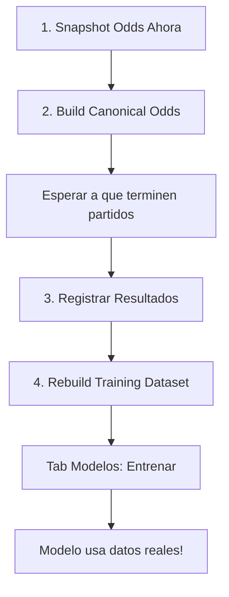

# Guía: Tab "Datos Reales" - Pipeline de Ingestión

Esta guía explica cómo funciona cada botón del tab **"Datos Reales"** en el panel de Streamlit y qué hace cada uno en el flujo de trabajo de datos reales.

---

## 🎯 Objetivo General

El tab "Datos Reales" te permite:
1. **Capturar odds** reales de partidos desde The Odds API
2. **Normalizar** esas odds para remover el margen de las casas de apuestas
3. **Registrar resultados** finales de partidos
4. **Generar features** automáticos (estadísticas rolling, días de descanso, etc.)
5. **Construir datasets** de entrenamiento reales para reemplazar los datos sintéticos

---

## 📊 Estadísticas en Tiempo Real

En la parte superior del tab verás contadores como:

```
Snapshots: 150 | Canonical: 120 | Resultados: 80 | Features: 75
```

**Qué significan:**
- **Snapshots**: Número total de capturas de odds (puede haber múltiples snapshots por partido)
- **Canonical**: Partidos con odds canónicas ya normalizadas (1 por partido)
- **Resultados**: Partidos con resultado final registrado
- **Features**: Partidos con características ingenierizadas calculadas

---

## 🔘 Botón 1: "Snapshot Odds Ahora"

### ¿Qué hace?

1. **Consulta The Odds API** para obtener partidos disponibles con odds reales
2. **Aplica filtros de calidad**:
   - Rechaza partidos con menos de 2 bookmakers
   - Rechaza odds inválidas o faltantes
   - Rechaza odds extremas (>20.0)
3. **Guarda** los datos en la tabla `raw_odds_snapshots` de la base de datos
4. **Reporta** cuántos partidos se guardaron y cuántos se omitieron

### Ejemplo de salida:
```
Snapshot guardado: 23 partidos (skipped 4)
```

### ¿Cuándo usarlo?

- **Antes de los partidos**: idealmente 1-2 horas antes del inicio para capturar las mejores odds
- **Regularmente**: cada vez que quieras actualizar tu base de datos de odds
- **Límite**: Ten en cuenta que la API gratuita tiene 500 requests/mes

### Detalles técnicos:

**Qué se guarda:**
- `match_id`: ID único del evento (de la API)
- `sport`, `league`, `home_team`, `away_team`: Info del partido
- `match_date`: Fecha/hora de inicio
- `snapshot_time`: Timestamp de cuándo se capturó
- `bookmakers_count`: Cuántas casas de apuestas reportaron odds
- `home_win_odds`, `away_win_odds`, `draw_odds`: Odds promediadas
- `source`: 'the_odds_api'

**Filtros aplicados:**
```python
# Rechaza si:
bookmakers_count < 2          # Muy pocas fuentes
home_win_odds > 20.0          # Odds poco realistas
away_win_odds > 20.0
home_win_odds is None         # Datos incompletos
away_win_odds is None
```

---

## 🔘 Botón 2: "Build Canonical Odds"

### ¿Qué hace?

1. **Lee todos los snapshots** de la tabla `raw_odds_snapshots`
2. Para cada partido, **selecciona el último snapshot** antes del inicio
3. **Calcula probabilidades implícitas**:
   - Implied Home = 1 / home_odds
   - Implied Away = 1 / away_odds
   - Implied Draw = 1 / draw_odds
4. **Calcula el margen** total (suma de probabilidades implícitas)
5. **Normaliza** dividiendo cada probabilidad por el margen (remueve el profit de las casas)
6. **Guarda** en `canonical_odds` (una sola fila por partido)

### Ejemplo de cálculo:

**Odds capturadas:**
- Home: 2.10 → Implied: 0.476 (47.6%)
- Away: 3.50 → Implied: 0.286 (28.6%)
- Draw: 3.20 → Implied: 0.313 (31.3%)
- **Margen total**: 1.075 (7.5% de profit para las casas)

**Odds normalizadas (sin margen):**
- Home: 0.476 / 1.075 = 0.443 (44.3%)
- Away: 0.286 / 1.075 = 0.266 (26.6%)
- Draw: 0.313 / 1.075 = 0.291 (29.1%)
- **Total**: 100% exacto

### Ejemplo de salida:
```
Canonical odds generadas para 18 partidos nuevos
```

### ¿Cuándo usarlo?

- **Después** de capturar snapshots
- **Antes** de construir el dataset de entrenamiento
- Solo procesa partidos que aún no tienen odds canónicas (no duplica)

---

## 🔘 Botón 3: Formulario "Registrar Resultado Manual"

### ¿Qué hace?

Te permite ingresar manualmente el resultado final de un partido.

### Campos del formulario:

1. **match_id**: El ID exacto del evento (copiarlo de los snapshots o la API)
2. **Resultado**: Dropdown con opciones:
   - `home_win`: Ganó el equipo local
   - `away_win`: Ganó el visitante
   - `draw`: Empate
3. **Home score**: Goles/puntos del local
4. **Away score**: Goles/puntos del visitante

### Ejemplo:

```
match_id: 3fa85f64-5717-4562-b3fc-2c963f66afa6
Resultado: home_win
Home score: 3
Away score: 1
```

### ¿Cuándo usarlo?

- **Después de que termine el partido**
- Cuando tengas los resultados finales disponibles
- Es necesario para poder construir el dataset de entrenamiento (modelo aprende de resultados reales)

### Nota importante:

🔴 **Actualmente es manual** - En una versión futura se puede automatizar conectando a:
- The Odds API (endpoint de scores)
- API-Football.com
- Web scraping de resultados

---

## 🔘 Botón 4: "Rebuild Training Dataset"

### ¿Qué hace?

Este es el botón más complejo - **construye el dataset completo** listo para entrenar:

### Paso 1: Generar Features
Calcula características ingenierizadas para cada partido:

**Features calculadas:**
- `win_pct_home_last5`: % de victorias del equipo local en últimos 5 partidos
- `win_pct_away_last5`: % de victorias del equipo visitante en últimos 5 partidos
- `rest_days_home`: Días de descanso del local (placeholder: 3.0)
- `rest_days_away`: Días de descanso del visitante (placeholder: 3.0)
- `avg_home_odds_last5`: Odds promedio del local en últimos 5 partidos
- `avg_away_odds_last5`: Odds promedio del visitante en últimos 5 partidos

### Paso 2: Unir Tablas (JOIN)
Hace un SQL JOIN de:
```sql
canonical_odds ⋈ engineered_features ⋈ raw_match_results
```

Solo incluye partidos que tienen:
- ✅ Odds canónicas
- ✅ Features calculados
- ✅ Resultado final registrado

### Paso 3: Limpiar y Preparar
- Elimina valores NULL (rellena con 0)
- Renombra `result_label` → `result`
- Selecciona solo columnas numéricas

### Paso 4: Separar por Deporte
Crea dos datasets:
- `data/training_real_soccer.csv` (soccer)
- `data/training_real_nba.csv` (nba)

### Paso 5: Validar
Si hay menos de 30 filas totales, muestra advertencia:
```
Dataset insuficiente, continuar con sintético.
```

### Ejemplo de salida exitosa:
```
Dataset real creado: soccer=45 filas, nba=38 filas
```

### ¿Cuándo usarlo?

- **Después** de tener:
  - ✅ Snapshots capturados
  - ✅ Canonical odds generadas
  - ✅ Resultados registrados
- **Antes** de entrenar modelos
- Cada vez que agregues nuevos partidos completos

### ¿Qué pasa después?

El script de entrenamiento (`train_model.py`) **automáticamente**:
1. Busca `data/training_real_soccer.csv`
2. Si existe y tiene suficientes filas → **usa datos reales**
3. Si no existe → usa datos sintéticos como fallback

---

## 🔄 Flujo de Trabajo Completo

### Configuración inicial (una vez):

1. **Obtener API Key**:
   - Ir a https://the-odds-api.com/
   - Sign up (gratis - 500 requests/mes)
   - Copiar tu API key

2. **Crear archivo .env**:
   ```bash
   # En la raíz del proyecto
   ODDS_API_KEY=tu_api_key_aqui
   ```

### Flujo diario/semanal:



### Ejemplo práctico:

**Lunes 10:00 AM** (antes de partidos de Champions League):
1. Click "Snapshot Odds Ahora" → Captura 15 partidos
2. Click "Build Canonical Odds" → Genera odds normalizadas para esos 15

**Lunes 11:00 PM** (después de los partidos):
3. Registrar resultados manualmente para cada partido (usar formulario)
   - Repetir 15 veces con cada match_id y resultado

**Martes 9:00 AM**:
4. Click "Rebuild Training Dataset" → Genera CSV con 15 partidos nuevos
5. Ir al tab "Modelos" → Click "Entrenar Modelos Ahora"
6. El modelo ahora se entrena con datos reales + históricos

---

## 📈 Métricas de Éxito

### Mínimo recomendado para empezar:
- **50+ partidos** con resultados completos
- Al menos **2 semanas** de datos
- Mix de ligas y equipos

### Ideal para producción:
- **500+ partidos** históricos
- **3+ meses** de datos
- Cobertura de múltiples ligas

---

## ⚠️ Limitaciones Actuales

### 1. Resultados manuales
- Hay que ingresar cada resultado a mano
- **Solución futura**: Automatizar con API de scores

### 2. Features simplificados
- `rest_days` es placeholder (siempre 3.0)
- No incluye: lesiones, clima, árbitro, etc.
- **Solución futura**: Agregar más features desde otras APIs

### 3. Límite de API
- 500 requests/mes en plan gratuito
- ~16 requests/día si usas todo el cupo
- **Solución**: Optimizar capturas (solo ligas principales)

### 4. No hay validación de match_id
- Puedes ingresar un match_id que no existe
- **Solución futura**: Dropdown con partidos pendientes

---

## 🐛 Troubleshooting

### "No hay registros en model_registry"
→ Ir al tab Modelos y hacer click en "Entrenar Modelos Ahora"

### "Dataset insuficiente"
→ Necesitas al menos 30 partidos con: odds + features + resultado
→ Usa el flujo completo para más partidos

### "API key not configured"
→ Crear archivo `.env` con `ODDS_API_KEY=tu_clave`

### "Error guardando CSVs"
→ Verificar permisos de escritura en carpeta `data/`

### "Snapshot guardado: 0 partidos"
→ Verificar API key
→ Puede que no haya partidos disponibles en ese momento
→ Revisar cuota de requests restantes

---

## 💡 Tips y Mejores Prácticas

### 1. Captura estratégica
- Snapshot **1-2 horas antes** del inicio (odds más estables)
- No desperdicies requests en partidos muy lejanos
- Enfócate en ligas que apuestas

### 2. Consistencia
- Registra TODOS los resultados de los snapshots que capturas
- No dejes partidos a medias
- Mantén un calendario de cuándo registrar

### 3. Calidad > Cantidad
- 100 partidos bien registrados > 500 incompletos
- Verifica que match_ids coincidan
- Revisa resultados antes de entrenar

### 4. Monitoreo
- Revisa las estadísticas después de cada acción
- Si "Canonical" < "Snapshots" → hacer Build Canonical
- Si "Features" < "Canonical" → hacer Rebuild Dataset

### 5. Backup
- Haz backup de `data/betting_history.db` regularmente
- Exporta CSVs antes de re-entrenar

---

## 🚀 Roadmap Futuro

### Automatizaciones planeadas:
- [ ] Scheduler para snapshots automáticos pre-partido
- [ ] Integración con API de scores para resultados auto
- [ ] Webhook para notificaciones de nuevos partidos
- [ ] Bulk import de resultados desde CSV
- [ ] Dashboard de cobertura de datos (% partidos completos)
- [ ] Features avanzados (Form, H2H, mercado de apuestas)

---

## 📞 Soporte

Si algo no funciona:
1. Revisar logs en la consola de Streamlit
2. Verificar que todas las dependencias estén instaladas
3. Consultar `TROUBLESHOOTING.md` para errores comunes

---

**Última actualización**: Noviembre 2025  
**Versión del pipeline**: 1.0 MVP
